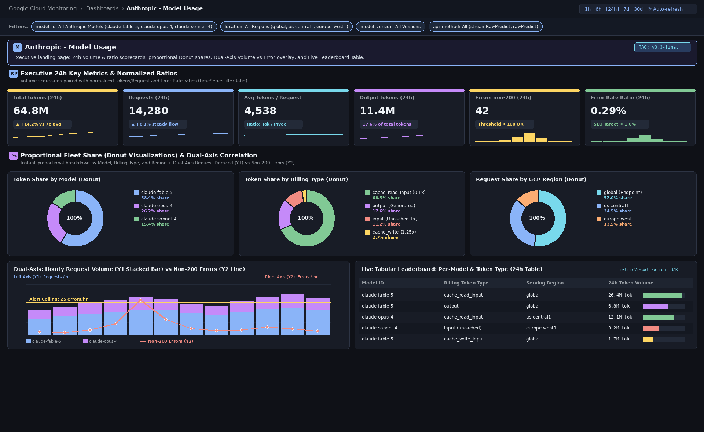
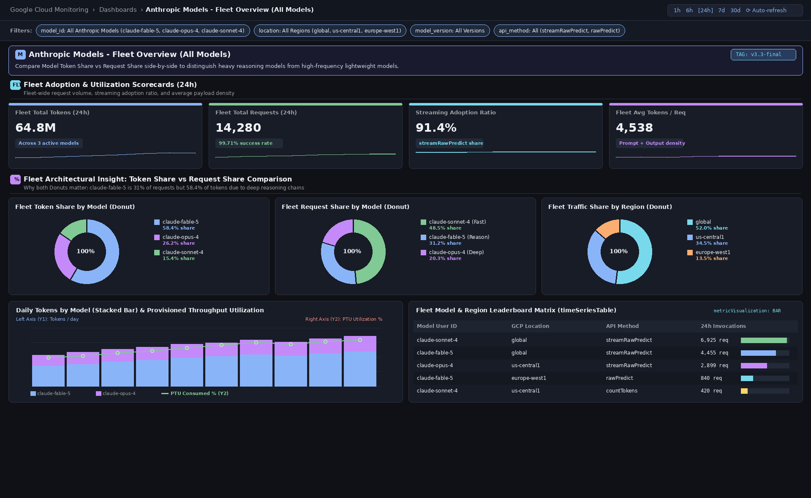
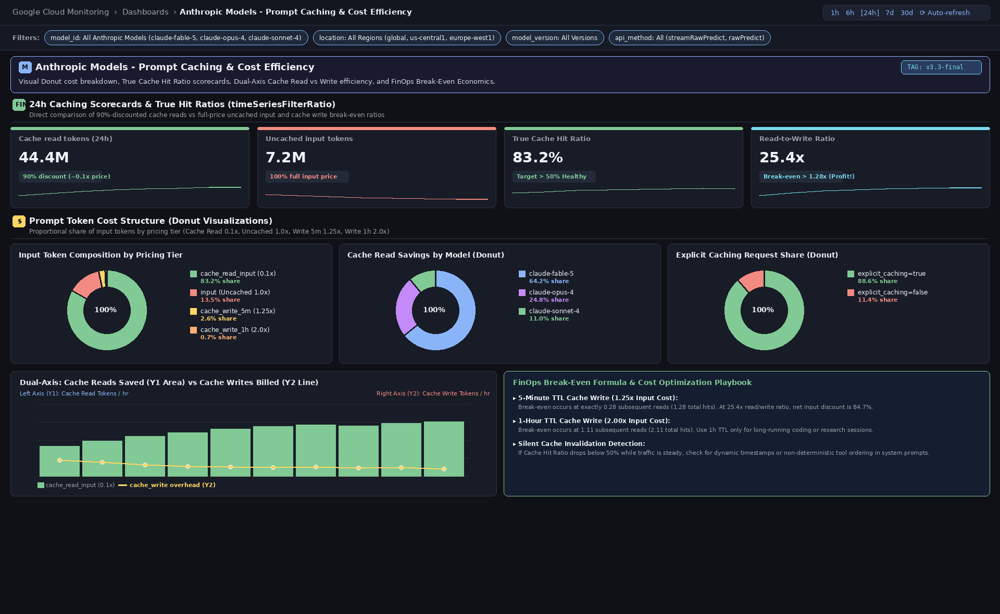
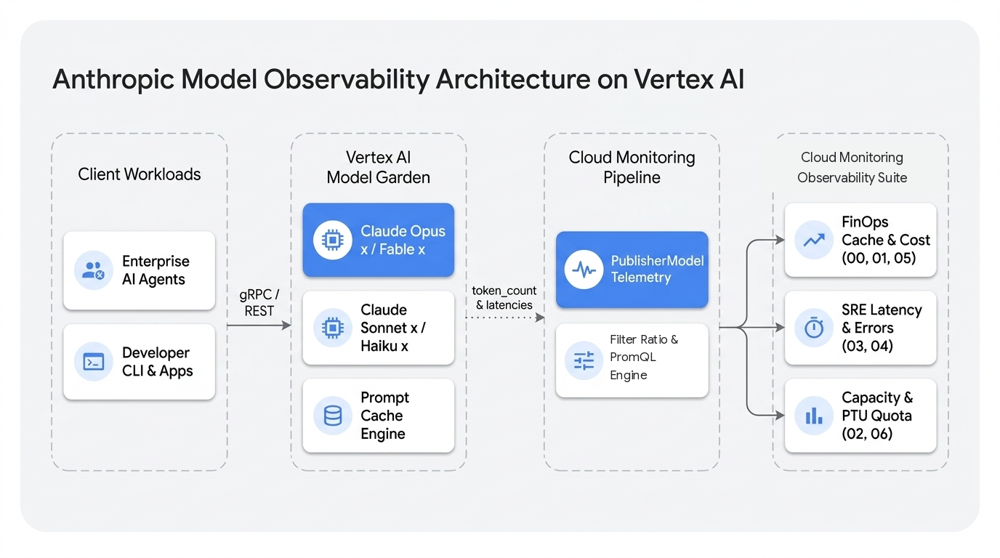
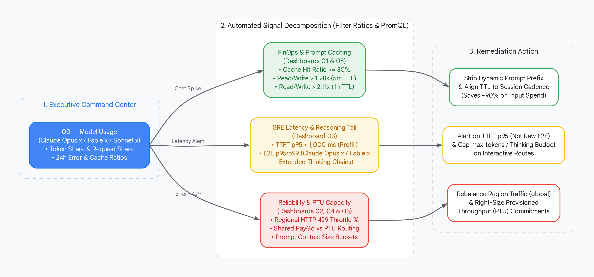

# Anthropic Model Monitoring on GCP (Vertex AI + Cloud Observability)

Zero-instrumentation **FinOps, SRE, and Capacity control plane** for Anthropic models (**`Claude Opus x`**, **`Claude Fable x`**, **`Claude Sonnet x`**, **`Claude Haiku x`**) on [Vertex AI Model Garden](https://cloud.google.com/vertex-ai/generative-ai/docs/partner-models/use-claude), built on native [`PublisherModel` telemetry](https://cloud.google.com/vertex-ai/docs/general/monitoring-metrics) and deployed via a single idempotent command (`./deploy.sh`).

### Live Cloud Monitoring Dashboards Preview



| Fleet Overview & Daily Volume (`02`) | Prompt Caching & Cost Efficiency (`05`) |
|---|---|
|  |  |

---

## Executive Statement: What Problem Is Being Solved?

| Operational Blind Spot | Risk if Unmonitored | How This Suite Solves It | Dashboard & Reference Docs |
|---|---|---|---|
| **Silent Prompt Cache Invalidation (FinOps)** | Dynamic prompt prefixes trigger `1.25×` (5m) or `2.00×` (1h) cache write penalties with zero reads — **doubling input spend** instead of saving 90%. | Real-time **Cache Hit Ratio %** and **Read-to-Write Break-Even** scorecards (`>1.28×` for 5m TTL, `>2.11×` for 1h TTL). | [05 — Caching](dashboards/05-anthropic-caching-efficiency.json) · [FinOps Math](docs/ARCHITECTURE_AND_PLAYBOOK.md#2-prompt-caching-finops-break-even-math) · [GCP Caching Docs](https://cloud.google.com/vertex-ai/generative-ai/docs/partner-models/claude-prompt-caching) |
| **Reasoning Tail Latency vs. Cold Starts (SRE)** | Extended thinking chains (`Claude Opus x` / `Claude Fable x`) take `15s–45s` `E2E` while `TTFT` stays `<1s`, causing false-positive latency paging. | Decouples **TTFT (`p50`/`p95`)** prefill latency from **E2E (`p50`/`p95`/`p99`)** generation tails via bimodal heatmaps & SLO lines. | [03 — Latency](dashboards/03-anthropic-latency-performance.json) · [SRE Playbook](docs/ARCHITECTURE_AND_PLAYBOOK.md#3-sre-latency--error-triage-rules) · [Streaming Docs](https://cloud.google.com/vertex-ai/generative-ai/docs/partner-models/use-claude#stream) |
| **Regional `HTTP 429` & PTU Skew (Capacity)** | Multi-region traffic spikes exhaust burst quotas (`429`) or under-utilize [Provisioned Throughput (`PTU`)](https://cloud.google.com/vertex-ai/generative-ai/docs/provisioned-throughput/overview). | Dual-Axis **Demand vs. `429` Throttling** overlays, regional Donut shares, and prompt size bucket histograms. | [04 — Errors](dashboards/04-anthropic-errors-reliability.json) · [06 — Capacity](dashboards/06-anthropic-capacity-quota.json) · [PTU Docs](https://cloud.google.com/vertex-ai/generative-ai/docs/provisioned-throughput/overview) |

---

## Quick Start

```sh
# 1. Authenticate with Google Cloud and set your target project
gcloud auth login
gcloud config set project YOUR_PROJECT_ID

# 2. Deploy the latest (v3.3-final) dashboards (idempotent: creates or updates in place)
./deploy.sh -p YOUR_PROJECT_ID

# Optional flags:
./deploy.sh -p YOUR_PROJECT_ID --both        # Deploy preserved [v2.0 Old] + v3.3-final side-by-side
./deploy.sh -p YOUR_PROJECT_ID --version old # Deploy a specific version (v1.0, v2.0, v3.1, v3.2, new)
./deploy.sh --validate                       # Validate all 42 JSON dashboards (0 tile overlaps)
```

---

## Dashboard Catalog (`v3.3-final`)

| # | Dashboard (`v3.3-final`) | Preserved `v2.0` Baseline | Primary Audience | Key Widgets (`Donut`, `Dual-Axis`, `Table`, `Ratio`) |
|---|---|---|---|---|
| **00** | [`00-anthropic-model-usage.json`](dashboards/00-anthropic-model-usage.json) | [`v2.0-old`](dashboards/versions/v2.0-old/00-anthropic-model-usage.json) | Exec / FinOps | 6 Ratio Scorecards · 3 Share Donuts · Volume vs. Error Dual-Axis · Live Leaderboard |
| **01** | [`01-fable5-token-usage.json`](dashboards/01-fable5-token-usage.json) | [`v2.0-old`](dashboards/versions/v2.0-old/01-fable5-token-usage.json) | AI Eng (`Opus x` / `Fable x`) | Cache Hit Ratio % · Token Volume vs. `p95` Latency Dual-Axis · Regional Table |
| **02** | [`02-anthropic-fleet-overview.json`](dashboards/02-anthropic-fleet-overview.json) | [`v2.0-old`](dashboards/versions/v2.0-old/02-anthropic-fleet-overview.json) | Platform / Fleet Leads | **Token Share vs. Request Share Donuts** · Multi-Model PTU & Invocation Matrix |
| **03** | [`03-anthropic-latency-performance.json`](dashboards/03-anthropic-latency-performance.json) | [`v2.0-old`](dashboards/versions/v2.0-old/03-anthropic-latency-performance.json) | SRE / Performance | Unified `p50`/`p95`/`p99` Curves + SLO Lines · **Dual TTFT & E2E Heatmaps** |
| **04** | [`04-anthropic-errors-reliability.json`](dashboards/04-anthropic-errors-reliability.json) | [`v2.0-old`](dashboards/versions/v2.0-old/04-anthropic-errors-reliability.json) | SRE / On-Call | True Error & `429` Ratios · Regional `429` Donut · Traffic vs. `429` Dual-Axis |
| **05** | [`05-anthropic-caching-efficiency.json`](dashboards/05-anthropic-caching-efficiency.json) | [`v2.0-old`](dashboards/versions/v2.0-old/05-anthropic-caching-efficiency.json) | FinOps / Prompt Eng | **True Cache Hit %** · **Read/Write Break-Even Ratio** · Pricing Tier Donuts |
| **06** | [`06-anthropic-capacity-quota.json`](dashboards/06-anthropic-capacity-quota.json) | [`v2.0-old`](dashboards/versions/v2.0-old/06-anthropic-capacity-quota.json) | Capacity / Infra | Input/Output Prompt Size Donuts · Shared PayGo vs. PTU Routing · Quota Table |

---

## Architecture & Triage Flow





> **Deep-Dive Documentation:** See **[Architecture, Metric Schema & FinOps/SRE Playbook (`docs/ARCHITECTURE_AND_PLAYBOOK.md`)](docs/ARCHITECTURE_AND_PLAYBOOK.md)** for native `timeSeriesFilterRatio` / [PromQL](https://cloud.google.com/monitoring/promql) query specifications (100% compliant with [Cloud Monitoring MQL deprecation](https://docs.cloud.google.com/stackdriver/docs/deprecations/mql)), pricing multipliers, and version lineage (`v1.0.0` → `v3.0.0`).

---

## Sample 30-Day Production Telemetry Benchmark

| Model Family (`model_user_id`) | `location` | Token `type` | 30-Day Volume | FinOps / SRE Benchmark |
|---|---|---|---:|---|
| **`claude-opus-x` / `claude-fable-x`** | `global` | `cache_read_input` | **39,115,765** | **94.9% Cache Hit Ratio** (`0.10×` cost tier) |
| **`claude-opus-x` / `claude-fable-x`** | `global` | `input` (uncached) | **2,113,023** | **24.6× Read-to-Write Ratio** (vs. `1.28×` 5m break-even) |
| **`claude-opus-x` / `claude-fable-x`** | `global` | `cache_write_input` (5m / 1h) | **2,062,295** | `1,588,561` (5m TTL) + `473,734` (1h TTL) |
| **`claude-opus-x` / `claude-fable-x`** | `global` | `output` | **548,924** | Reasoning + completion tokens |
| **`claude-sonnet-x`** / **`count-tokens`** | `global` | `input` / `output` | **379,508** | Lightweight eval & token-counting API calls |


